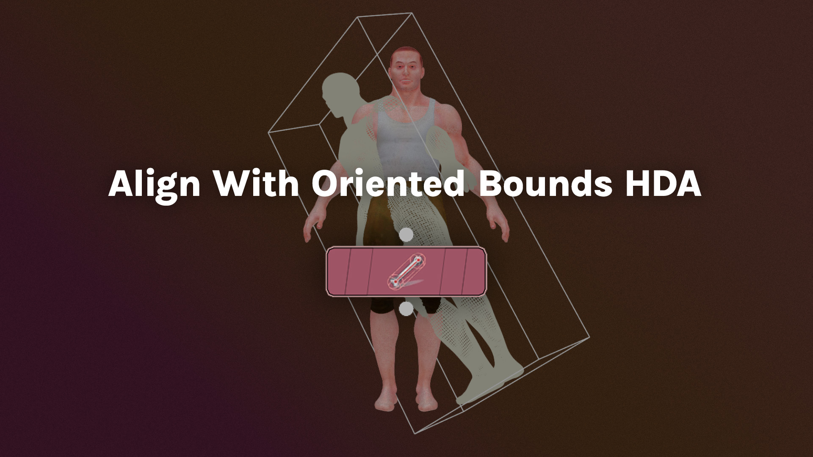
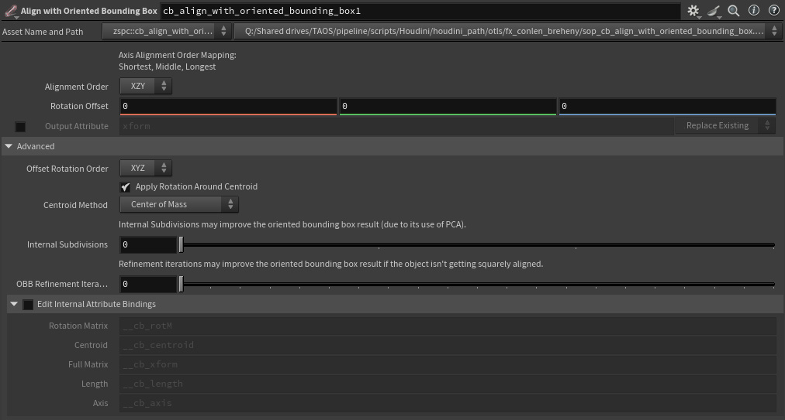

# **[Align With Oriented Bounding Box HDA](./sop_cb_align_with_oriented_bounding_box.1.0.hdalc)**

[`sop_cb_align_with_oriented_bounding_box.1.0.hdalc`](./sop_cb_align_with_oriented_bounding_box.1.0.hdalc)  
A Houdini Digital Asset (HDA) for the SOP level that aligns objects square to the world axes using the oriented bounding box.

This setup is useful if you have geometry without the proper attributes to restore its orientation to be aligned normal to the world XYZ planes. This is especially common with cached geometry you may receive from others or download from the internet.

## How To Use:
### Parameters

>**Alignment Order**: Determine how the object's shortest, second shortest, and longest axes get aligned to the world axes:
>   - **XYZ**: The shortest axis goes to X, middle to Y, longest to Z.
>   - **XZY**: The shortest axis goes to X, middle to Z, longest to Y (Default).
>   - **YXZ**: The shortest axis goes to Y, middle to X, longest to Z.
>   - **YZX**: The shortest axis goes to Y, middle to Z, longest to X.
>   - **ZXY**: The shortest axis goes to Z, middle to X, longest to Y.
>   - **ZYX**: The shortest axis goes to Z, middle to Y, longest to X.
>
>**Rotation Offset**: Apply a rotational offset to the result. Most useful in 180 degree increments to flip the result for a given alignment.
>
>**Toggle Output Attribute**: Whether to output a 4x4 matrix attribute stashing the transformation applied by this node.
>
>**Output Attribute**: The name of the 4x4 matrix attribute stashing the transformation applied by this node.
>
>**Output Merge**: The method to output the 4x4 matrix attribute:
>   - **Replace**: Replace an existing attribute of the same name if it already exists.
>   - **Pre-Multiply**: Pre-multiply the matrix with an existing attribute of the same name if it already exists.
>   - **Post-Multiply**: Post-multiply the matrix with an existing attribute of the same name if it already exists.

>#### Advanced
>**Offset Rotation Order**: The euler rotation order of the Rotation Offset parameter.
>
>**Apply Rotation Around Centroid**: Whether or not to apply the rotation in-place around the object's centroid.
>
>**Centroid Method**: The method for computing the centroid, if applying the rotation around the centroid.
>
>**Internal Subdivisions**: Applies subdivisions internally to the input geometry while computing the oriented bounding box, which might improve the oriented bounding box result when the input has a low/sparse point count, due to the usage of point cloud analysis needing enough data.
>
>**OBB Refinement Iterations**: Refinement Iterations for the Oriented Bounding Box operation. For many meshes, leaving this value at 0 is best. However, you may get a more accurate result if you increase this value depending on the input geometry.
>
>**Edit Internal Attribute Bindings**: Adjusts the names of the internally used attributes to potentially resolve naming conflicts with attributes on the input (unlikely to be necessary).