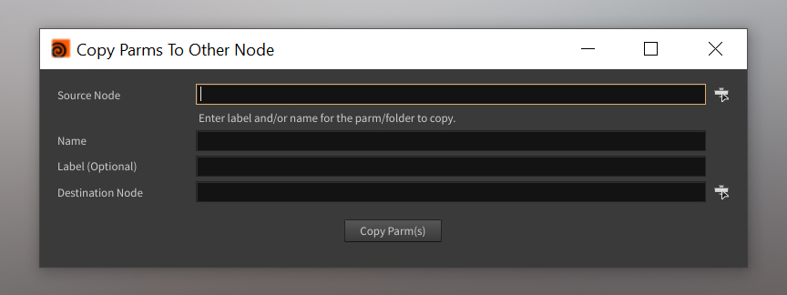

# **Copy Parms to Other Node**
A script to copy a parm or all parms in source parm folder from source node to the destination node.



## Installation
1. Download the folder `copy-parms-to-other-node`.
2. Move the files to Houdini's `packages` folder (eg. ``C:\Users\[USERNAME]\Documents\houdini21.0\packages``):
   - Copy the `copy-parms-to-other-node` folder into Houdini's `packages` directory
   - Inside the `copy-parms-to-other-node` folder, copy the `copy-parms-to-other-node.json` file and place it directly into Houdini's `packages` directory
        - On Windows `C:\Users\[USERNAME]\Documents\Houdini[VERSION]\packages`

    **Example Folder Structure:**  
    ```text
    ├── houdini##.#
        ├── packages/
            ├── copy-parms-to-other-node.json
            └── /copy-parms-to-other-node
                └── (package files incl. copyParmsToOtherNode folder)
    ```
3. Install QtPy:  
    The recommended method to install QtPy is with Houdini packages:
    1. Go back to your Houdini ``packages`` folder
    2. Create a folder called ``qtpy``
    3. Inside of that folder, create a folder called ``python[PYVERSION]libs`` (For Houdini 21 [PYVERSION] is ``3.11``; other versions of Houdini may use a different Python version)
    4. Open a terminal and run the following command (edit the `[PROGRAM_FILES_PATH]`, `[VERSION]`, ``[HOUDINI_PACKAGES_PATH]``, and ``[PYVERSION]`` to the path to your program files, the correct Houdini version, your Houdini packages path, and your Houdini Python version respectively):
        ```
        "[PROGRAM_FILES_PATH]\Side Effects Software\Houdini [VERSION]\bin\hython.exe" -m pip install --target=[HOUDINI_PACKAGES_PATH]\QtPy\python[PYVERSION]libs QtPy
        ```
    5. In your Houdini preferences packages folder, create a file ``qtpy.json``
    6. Set the contents of ``qtpy.json`` to:
        ```text
            {
                "enable" : false,
                "show" : true,
                "load_package_once" : true,
                "hpath": "$HOUDINI_PACKAGE_PATH/qtpy"
            }
        ```
    7. Your Houdini preferences folder should now also contain these directories:
        ```text
            ├── houdini##.#
                ├── packages/
                    ├── qtpy.json
                    └── /qtpy
                        ├── python#.##libs
                            ├── qtpy
                            ├── [Various other folders containing QtPy dependencies]
        ```

## Shelf Button Creation
1. In the Houdini interface, go to the **Shelf** area
2. **Right-click** on an empty space in the Shelf and select **New Tool...**
3. In the **Edit tool** window, in the **Script** tab, paste in the following Python code:
    ```python  
   from copyParmsToOtherNode import CopyParmsUI

    copy_parms_ui = CopyParmsUI()
    copy_parms_ui.display()
    ```
4. Click **Accept** to save the new button on the Shelf

## How To Use:
1. Click on your new shelf button to open the UI.
2. Type a node name, drag a node, or use the node browser to enter the source node to copy parameters from.
3. Enter the name (required) of the parameter or parameter folder to copy. Optionally, enter the label as well.
4. Type a node name, drag a node, or use the node browser to enter the source node to copy parameters to.
