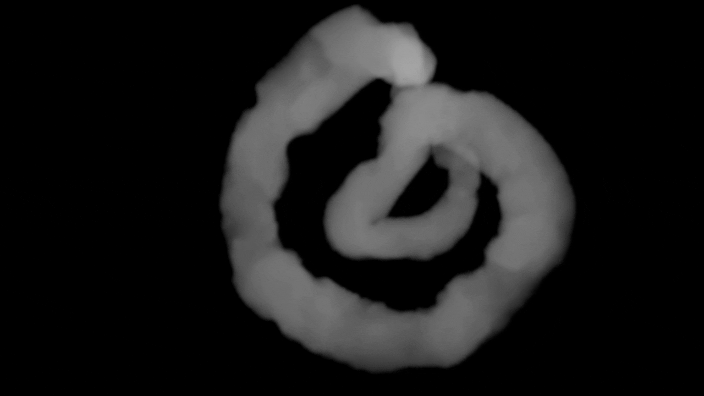
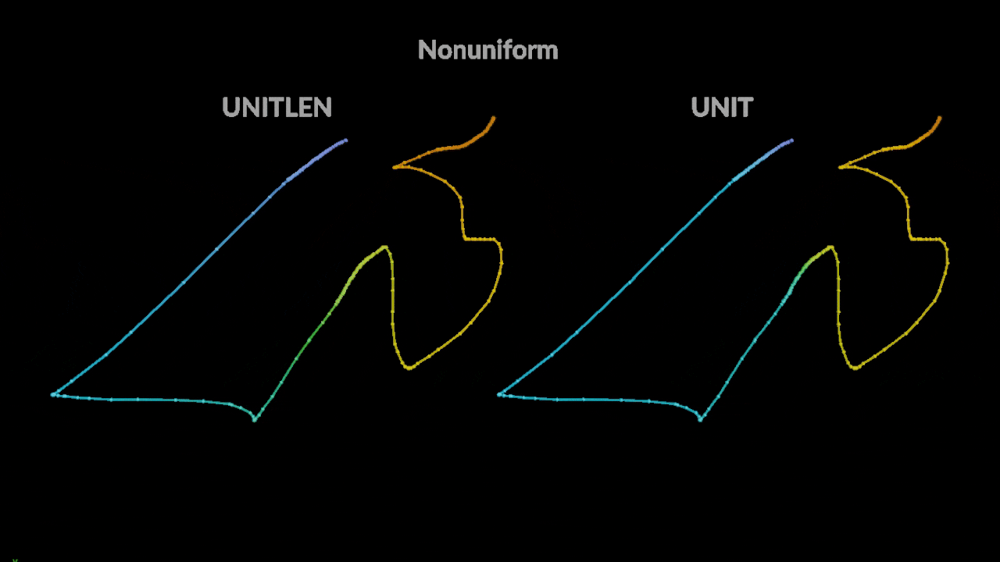
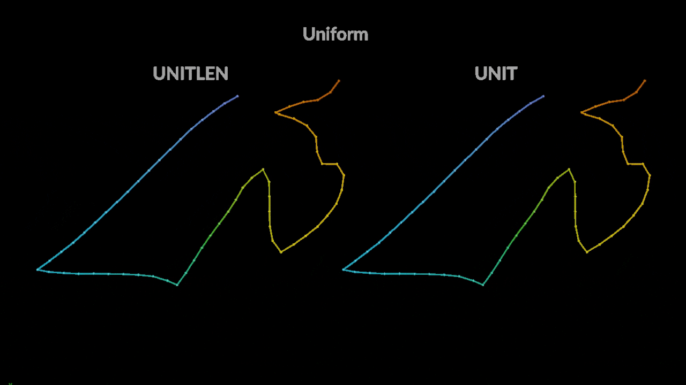

# Hip Quips!
Standalone hip files (not packaged tools) showing various techniques. Provided as-is and individual files are not guaranteed future updates or bugfixes.

Please feel free to tip if any of these files help and you'd like to support me!  
https://www.paypal.me/conlenb

## Curve Coordinate System: Copy Circles + Lines
These files both use one of my favorite techniques -- building a coordinate system along a curve by copying circles along the curve and then lines along the circles. I originally learned this methodology from Eric Araujo, and have since expanded it for various usecases.

### [Volume noise along curves](./curve-coordinate-system-copy-circles-lines/volume-noise-along-curves/curve_rest_volume_noise_copy_circles_lines_v003.hipnc)

Shows 3 methods of creating a "rest" coordinate system from the curve copied circles + line technique that can then be used to sample noise, either via rasterizing rest to a vector volume or by sampling the geometry rest attribute from another volume. See the sticky notes in the hip file for more info and detail.

| [Hip File](./curve-coordinate-system-copy-circles-lines/volume-noise-along-curves/curve_rest_volume_noise_copy_circles_lines_v003.hipnc) |
| --- |

### [Velocity pumps along curves](./curve-coordinate-system-copy-circles-lines/velocity-pumps-along-curves/CurveCopyCirclesLinesTricks_Pumps_v005.hipnc)

Shows a method for creating velocity fields from curves using the curve copied circles + line technique, where velocities along, around, and towards/away from the curve can be directed based on various controls. See the sticky notes in the hip file for more info and detail.

| [Hip File](./curve-coordinate-system-copy-circles-lines/velocity-pumps-along-curves/CurveCopyCirclesLinesTricks_Pumps_v005.hipnc) |
| --- |

## f@curveu: UNIT vs UNITLEN
The f@curveu attribute is used quite commonly, but there is more than one way to measure it along a curve. For those unfamiliar, curveu is a float attribute that traditionally is 0.0 at the root/base/start of a curve, and 1.0 at the tip/end of a curve. For points in between the root and tip, the curveu is some value between 0 and 1 based on how far along the curve that point (or vertex, alternatively) is.

The two most useful "measurements" of curveu in my opinion are called UNIT and UNITLEN in the primuvconvert() VEX function's docs. UNIT is measured based on each point's number, eg. if a curve has 5 points, the 3rd point would have a curveu of 0.5. UNITLEN is measured based on the arc length of the curve, so a point that is exactly halfway along the length of the curve would have a curveu of 0.5.

When it comes to comparing the two, if a curve has evenly spaced points eg. from a resample SOP, UNIT and UNITLEN are almost identical (with small decimal place differences). However, if the curve is nonuniform in its distribution of points, UNITLEN and UNIT will be different. UNIT coordinates are used for intrinsic/parametric coordinates and are expected as the input for functions such as primuv(). However, UNITLEN coordinates in my experience are often desirable as many effects benefit from taking into account the actual arc length of the curve, without getting disrupted by the density/sparsity of points.

In the videos below, you can see how the carve animation based on UNITLEN respects the linear keyframes for both uniform and nonuniform point counts, but UNIT gets disrupted by the sparsity/density of points for the nonuniform curve. While the snappiness might look cool in this example, in my opinion it would be better to achieve that kind of snappiness with animation keyframes, which UNITLEN will respect.

| [Hip File](./unit-vs-unitlen-curveu/UNIT_vs_UNITLEN_curveu.hipnc) |
| --- |