# **[POP Interaction Forces HDA](./dop_cb_pop_interaction_forces.1.0.hdanc)**
[`dop_cb_pop_interaction_forces.1.0.hdanc`](./dop_cb_pop_interaction_forces.1.0.hdanc)  
An HDA implementation of DreamWorks Animation's paper ["Shaping Particle Simulations with Interaction Forces"](https://dl.acm.org/doi/10.1145/2614106.2614121) (Can Yuksel et al.).

This tool enables complex and art-directable particle motion and shaping derived from the existing intrinsic qualities of the particle field.

https://github.com/user-attachments/assets/a5bbffb9-a720-41a4-aec8-65c09296b3a3

## How To Use:
Example .hip file here:  
[`POP_Interaction_Forces_Chain_Fluid_DreamWorks_v020.hipnc`](./example-hip/POP_Interaction_Forces_Chain_Fluid_DreamWorks_v020.hipnc)

### Theory
To use this tool effectively, it is helpful to broadly understand how it works under the hood.
#### Local Axes
First, each point in the point cloud looks at all of its neighbors within a given radius.  
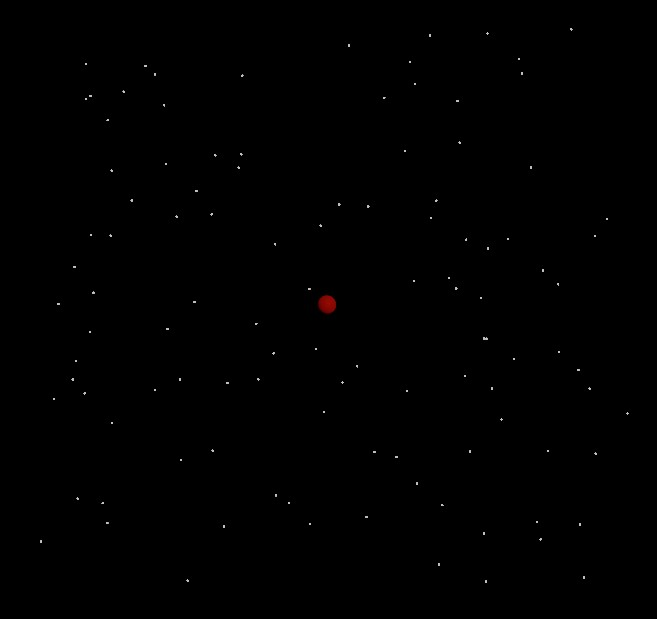
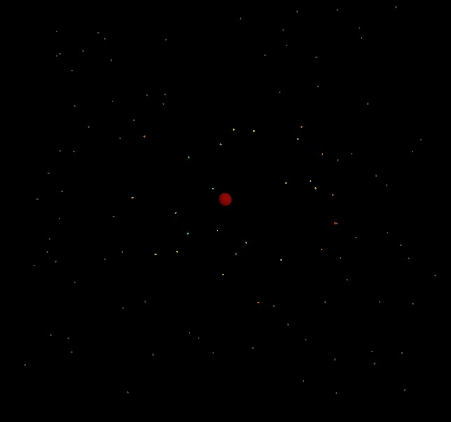
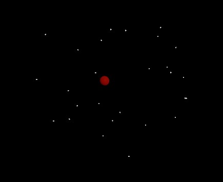

Next, the average/mean of all of the neighbors is marked as the "LDNP center"/center of mass.  
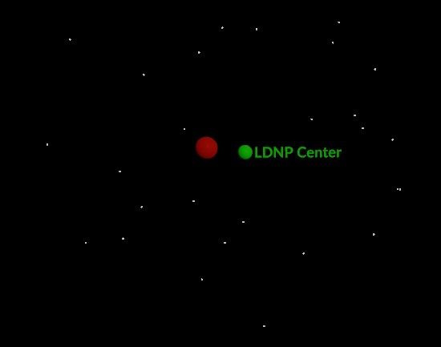

Then, the local axes of the cluster is calculated so that the X/U axis is aligned down the longest part of the cluster, the Y/V axis is aligned to the second longest, and the Z/W axis is aligned to the shortest part of the cluster.  
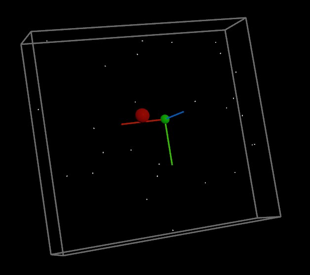

After that, the local axes are "stabilized" to prevent flipping between frames. The X axis is stabilized so that it points more towards the velocity vector of the point than it does away from it, the Y axis is stabilized to a user defined "Eigen Y Target" vector, and the Z axis is reconstructed from those.  
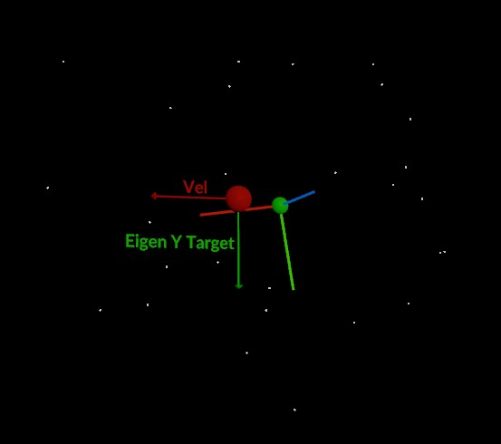
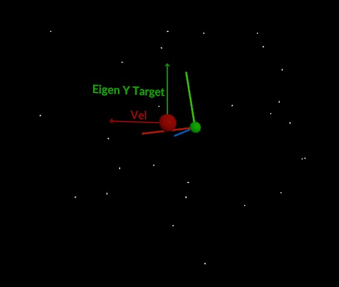

#### Forces
Once the local axes have been found and stabilized, they can be used to create custom forces based on user parameters.

The first force option is "To Center", which is simply a force that directs the particle towards the center of mass of its neighbors.  
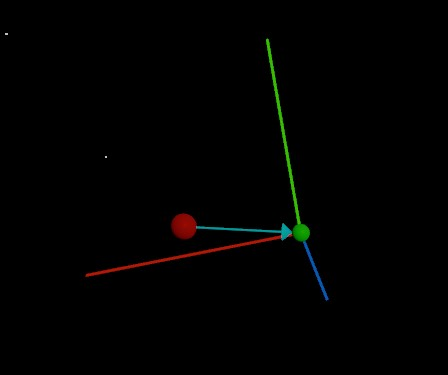

The next force is "Along Axes", which allows you to push/pull particles in the direction (or the opposite direction) of each local axis.  
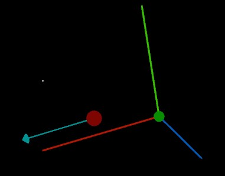
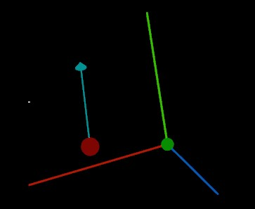
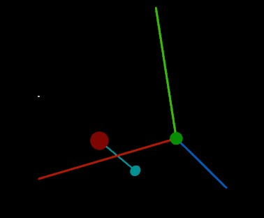

"To Axes" allows you to move particles towards (or away from) the nearest point on the local axis from the LDNP center.
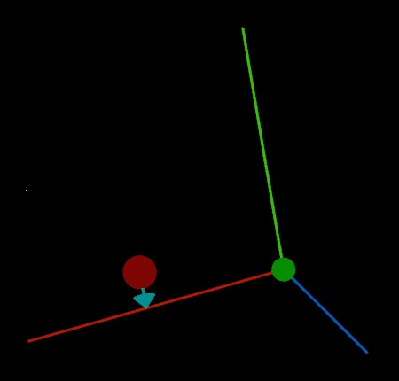
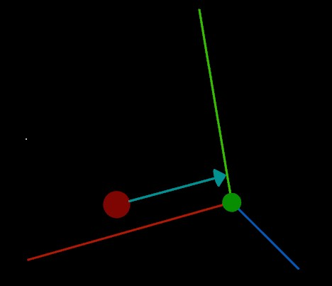
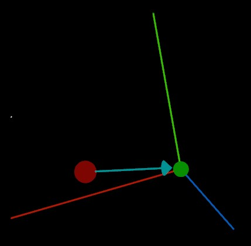

The final force, "Around Axes", moves the particles so that they orbit around the local axes.  
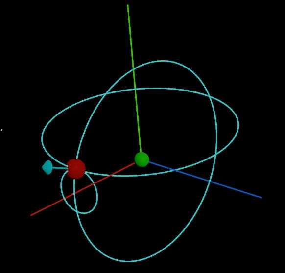
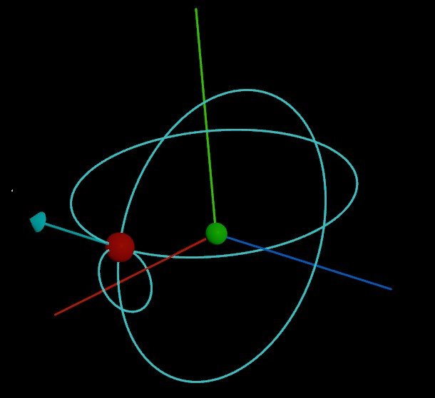
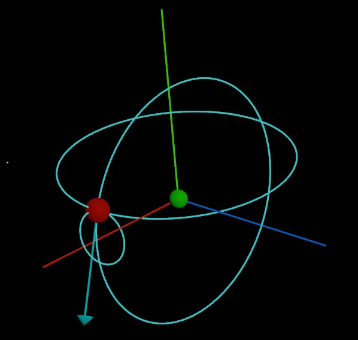

### Parameters
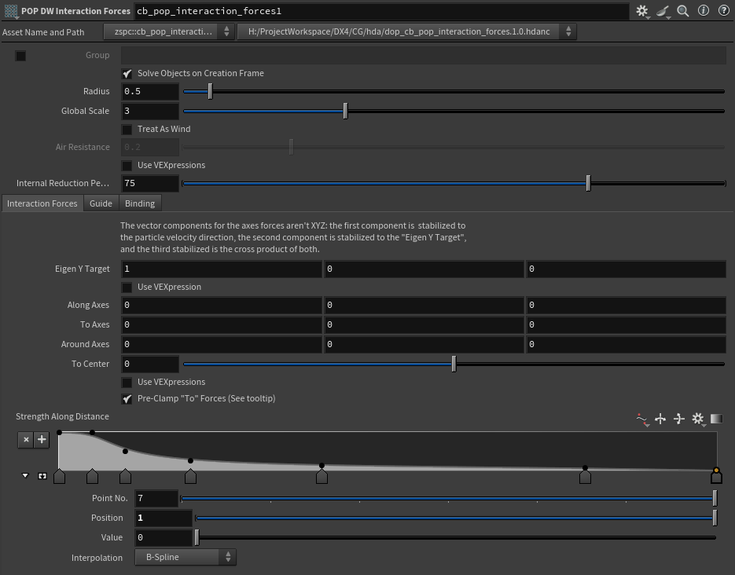
  

> **Group:** The point group to apply the forces to.
>
> **Solve Objects on Creation Frame:** Whether the internal SOP solver DOP should solve objects on creation frame.
>
> **Radius:** The radius that each particle should use to construct its local cluster.
>
>**Global Scale:** A global multipler on the force applied.
>
>**Treat As Wind:** Instead of adding force, the targetv and airresist attributes are used as a "wind speed" to be matched by the particle. This causes the particle to be dragged to the goal speed, reducing overshoot.
>
>**Air Resistance:** How much particles are to be influenced by this wind field.
>
>**Internal Reduction Percent:** As an optimization, what percent of the particles are ignored when calculating the local axes internally.

>#### Interaction Forces
>**Eigen Y Target**:

*Docs are work in progress/unfinished*