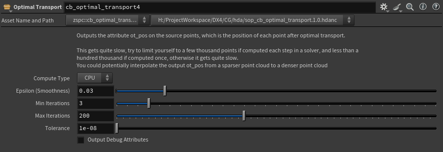

# **[Optimal Transport SOP HDA](./sop_cb_optimal_transport.1.0.hdanc)**
[`sop_cb_optimal_transport.1.0.hdanc`](./sop_cb_optimal_transport.1.0.hdanc)

A Houdini Digital Asset (HDA) for the SOP level that provides a convenient wrapper over my Optimal Transport Python scripts below.

https://github.com/user-attachments/assets/ab72bd16-ce38-445a-b258-ddc39c82729e


## How To Use:
Import into Houdini with File > Import > Houdini Digital Asset.  
In a SOP context network, search for "Optimal Transport".  
Connect the source points to transport in the first input, and the target points to transport to in the second input.  

Select the compute type (GPU is only available if CuPy and NVIDIA CUDA Toolkit are installed; see the [GPU script description](#gpu-sinkhorn-based-log-domain-optimal-transport) for more info).

Outputs the attribute ot_pos on the source points, which is the position of each point after optimal transport. See the [example hip file](./example-hip/) for example usage.

### Parameters


>**Compute Type**: Whether to use CPU or GPU with CuPy (GPU Requires CuPy and NVIDIA CUDA Toolkit installed, see [GPU script description](#gpu-sinkhorn-based-log-domain-optimal-transport) for more info).
>
>**Epsilon (Smoothness)**: Smoothness of the result, lower is more rigid, higher is more "blurred". Default 0.03.
>
>**Min Iterations**: Minimum iterations for transport to converge. Default 3.
>
>**Max Iterations**: aximum iterations for transport to converge. Higher = more accurate, but slower to compute. Default 200.
>
>**Tolerance**: A tolerance threshold for when the result is considered converged. The lower the value, the more accurate the result will be, but it will also have higher potential to reach max iterations. Default 1e-08.
>
>**Output Debug Attributes**: Outputs the detail attributes `_ot_converge_type` and `_ot_iterations`. Iterations is the final number of iterations used. Converge type is the condition that was used to stop iterating (Error < Tolerance, Stagnation, or Max Iterations Reached). Default False. 

<br><br><br>


# **[Sinkhorn-Based Log Domain Optimal Transport Script](./SinkhornBasedLogDomainOptimalTransportHoudini.py)**
[`SinkhornBasedLogDomainOptimalTransportHoudini.py`](./SinkhornBasedLogDomainOptimalTransportHoudini.py)

An implementation of Optimal Transport that is sinkhorn based and performed in the log domain.  
Based off of the algorithm outlined in Remark 4.23 "Computational Optimal Transport" (2019) by Gabriel Peyré & Marco Cuturi https://arxiv.org/abs/1803.00567

Heavily commented in the form of notes/documentation for myself as I was learning this.

## How To Use:
Place in a python SOP, and create the required parameters on the SOP:  
"epsilon" : float (Hard min: 1e-10; Soft Max: 0.2; Default: 0.03)  
"min_iterations" : int (Hard min: 0; Soft Max: 30; Default: 3)  
"max_iterations" : int (Hard min: 1; Soft Max: 500; Default: 200)  
"tolerance" : float (Hard min: 1e-12; Soft Max: 0.1; Default: 1e-8)  
"output_debug_attrs" : toggle (Default: False)

Note: The main code block below all definitions requires `__name__` == "builtins", which is `__name__` for the Python SOP in Houdini 20.5.

Plug in the source point cloud in the Python SOP's first input, and the target point cloud in the Python SOP's second input.

Outputs the attribute ot_flat_pos_array on the source points, which is a flattened list of the positions of each point after optimal transport.  
A point wrangle after the Python SOP can convert this to a per-point vector attribute with the following code:

    float ot_flat_pos_array[];
    ot_flat_pos_array = detail(0, "ot_flat_pos_array");

    vector ot_pos;

    int index = @ptnum * 3;

    ot_pos.x = ot_flat_pos_array[index];
    ot_pos.y = ot_flat_pos_array[index+1];
    ot_pos.z = ot_flat_pos_array[index+2];

    v@ot_pos = ot_pos;

This gets quite slow, try to limit yourself to a few thousand points if computed each step in a solver, and less than a hundred thousand if computed once, otherwise it gets quite slow.  
You could potentially interpolate the output ot_pos from a sparser point cloud to a denser point cloud.
<br><br><br>


# **[GPU Sinkhorn-Based Log Domain Optimal Transport Script](./GPUSinkhornBasedLogDomainOptimalTransportHoudini.py)**
[`GPUSinkhornBasedLogDomainOptimalTransportHoudini.py`](./GPUSinkhornBasedLogDomainOptimalTransportHoudini.py)

A GPU implementation of Optimal Transport using CuPy (GPU drop-in for Numpy) that is sinkhorn based and performed in the log domain.  
Based off of the algorithm outlined in Remark 4.23 "Computational Optimal Transport" (2019) by Gabriel Peyré & Marco Cuturi https://arxiv.org/abs/1803.00567

Requires the Cuda developer toolkit to be installed, CuPy to be installed in the Houdini Python environment, and for the ``CUDA_PATH`` and ``PATH`` environment variables to point to the Cuda Developer toolkit.

Check your GPU to see what version of Cuda it supports, and install the corresponding CuPy and Cuda Developer Toolkits of matching versions.

Tested with [Cuda Developer Toolkit 13.0.2](https://developer.nvidia.com/cuda-13-0-2-download-archive) + [cupy-cuda13x 13.6.0](https://pypi.org/project/cupy-cuda13x/13.6.0/) on Windows 10 on an RTX 3090.

The recommended method for installing CuPy in the Python Environment and setting the proper environment variables is to use a package:
1. Go to your Houdini preferences packages folder (eg. ``C:\Users\[USERNAME]\Documents\houdini21.0\packages``)
2. Create a folder called ``cupy``
3. Inside of that folder, create a folder called ``python[PYVERSION]libs`` (For Houdini 21 [PYVERSION] is ``3.11``; other versions of Houdini may use a different Python version)
4. Open a terminal and run the following command (edit the `[PROGRAM_FILES_PATH]`, `[VERSION]`, ``[HOUDINI_PACKAGES_PATH]``, ``[PYVERSION]``, and ``[CUDAVERSION]`` to the path to your program files, the correct Houdini version, your Houdini packages path, your Houdini Python version, and your Cuda version (eg. ``13``) respectively): 
    ```
    "[PROGRAM_FILES_PATH]\Side Effects Software\Houdini [VERSION]\bin\hython.exe" -m pip install --target=[HOUDINI_PACKAGES_PATH]\cupy\python[PYVERSION]libs cupy-cuda[CUDAVERSION]x
    ```
5. In your Houdini preferences packages folder, create a file ``cupy.json``
6. Set the contents of ``cupy.json`` to (Adjust the path to the CUDA GPU Computing Toolkit correctly):
    ```
    {
        "enable" : true,
        "show" : true,
        "load_package_once" : true,
        "hpath": "$HOUDINI_PACKAGE_PATH/cupy",
        "env": [
            {
                "PATH" : {
                    "value": "[PROGRAM_FILES_PATH]/NVIDIA GPU Computing Toolkit/CUDA/v[CDK_VERSION]/bin",
                    "method": "prepend"
                },
                "CUDA_PATH" : {
                    "value": "[PROGRAM_FILES_PATH]/NVIDIA GPU Computing Toolkit/CUDA/v[CDK_VERSION]",
                    "method": "prepend"
                }
            }
        ]
    }
    ```
7. Your Houdini preferences folder should now look like this:
    ```text
        ├── houdini##.#
            ├── packages/
                ├── cupy.json
                └── /cupy
                    ├── python#.##libs
                        ├── cupy
                        ├── [Various other folders containing cupy dependencies]
    ```

Heavily commented in the form of notes/documentation for myself as I was learning this.

## How To Use:
Same as CPU implementation.
