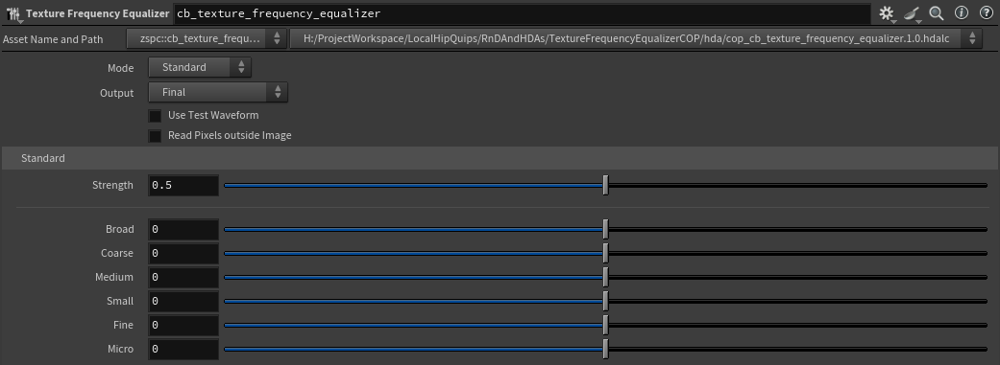

# **[Texture Frequency Equalizer Copernicus HDA](./cop_cb_texture_frequency_equalizer.1.0.hdalc)**
[`cop_cb_texture_frequency_equalizer.1.0.hdalc`](./cop_cb_texture_frequency_equalizer.1.0.hdalc)  
Cinematographers obsess over the softness and sharpness of their images, deliberating over lens choice, shooting settings, and post production decisions to dial in the textural look that suits their creative vision.

As CG artists, we too often ship our renders out of the box, perhaps with just a small amateurish blur to "fix" CG's unnatural sharpness.

With this Houdini Copernicus HDA, unlock tools used by Cinematographers and Colorists in professional Finishing software such as FilmLight's Baselight and DaVinci Resolve! Sculpt the softness and sharpness of your image across different sizes of detail to achieve a more photographic and cinematic result, all in the pursuit of your creative and narrative intent.

## How To Use:
Example .hip file here:  
[`TextureFrequencyEqualizerCOP_v008.hiplc`](./example-hip/TextureFrequencyEqualizerCOP_v008.hiplc)

TODO: Insert YouTube Video

### Parameters

>**Mode**: Switch between standard mode with 6 pre-defined frequency bands, or single band mode to define a custom frequency band.
>
>**Output**: Switch between 3 output modes:
>   - **Final**: The result of the softening and sharpening applied to the image.
>   - **Visualize Difference**: A visualization of the regions affected by the softening and sharpening.
>   - **Raw Band(s)**: The raw frequency bands being applied to the image; likely small floating point numbers both positive and negative.
>
>**Use Test Waveform**: Overrides the input image with a sine wave with increasing frequency to visualize the frequency manipulation.
>
>**Read Pixels outside Image**: (From internal Blur COP) Adds contributions from pixels outside of the image. This depends on the border type, which determines what pixels to read as outside of the image.

>#### Standard
>**Strength**: Controls the overall strength of the effect.
>
>**Broad**: Adjusts the Broad frequencies of the input image (negative values will soften, positive values will sharpen).
>
>**Coarse**: Adjusts the Coarse frequencies of the input image (negative values will soften, positive values will sharpen).
>
>**Medium**: Adjusts the Medium frequencies of the input image (negative values will soften, positive values will sharpen).
>
>**Small**: Adjusts the Small frequencies of the input image (negative values will soften, positive values will sharpen).
>
>**Fine**: Adjusts the Fine frequencies of the input image (negative values will soften, positive values will sharpen).
>
>**Micro**: Adjusts the Micro frequencies of the input image (negative values will soften, positive values will sharpen).

>#### Single Band
>**Strength**: Controls the overall strength of the effect.
>
>**Min Size**: The size in pixels of the minimum included frequency (value should be smaller than the Max Size).
>
>**Max Size**: The size in pixels of the Maximum included frequency (value should be larger than the Min Size)
>
>**Soften/Sharpen**: Adjusts the selected frequency band of the input image (negative values will soften, positive values will sharpen).
>
>**Scale Soften**: Scales the amount of softening on the selected frequency band of the input image.
>
>**Scale Sharpen**: Scales the amount of sharpening on the selected frequency band of the input image.